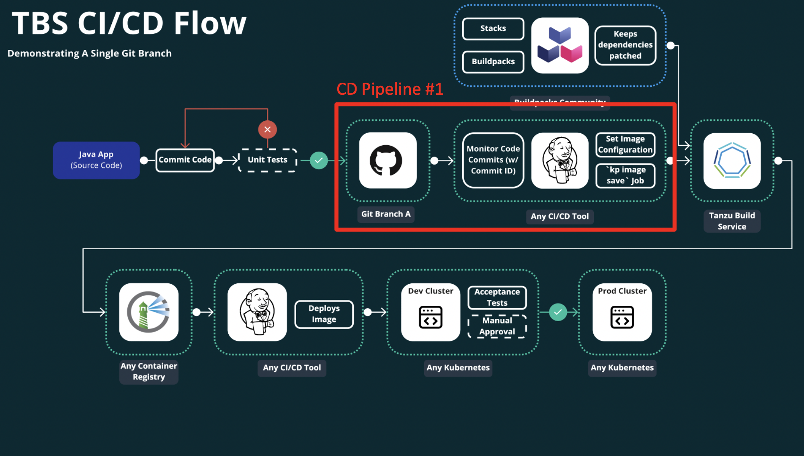
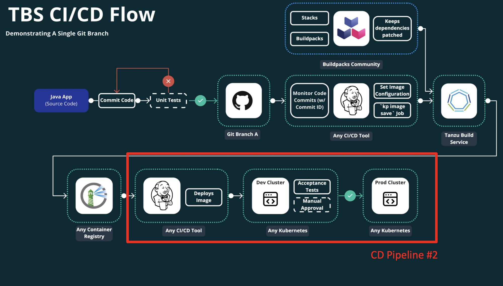

# Deployment Guide

The purpose of this guide is to provide examples of how you can leverage the [Tanzu Build Service](https://tanzu.vmware.com/build-service) as part of your CI/CD pipeline. It will use the [Spring PetClinic](https://github.com/spring-projects/spring-petclinic) application as the sample application to deploy.

The end goal will be for examples to be available for all the most common CI/CD solutions, as well as as the most common docker registeries.

The current available samples are:

| CD Solution | Registry |
| ----------- | ----------- |
| Azure DevOps | Harbor |

# Pre-requisites 

This guide assumes all of the following are available for the example pipelines:

1.  A Kubernetes Cluster
2.  Tanzu Build Service installed per the [installation docs](https://docs.pivotal.io/build-service/1-2/installing.html)
3.  A Docker image registry capable of making a webhook call when a container is pushed

# Pipeline Workflow

The examples will follow the [feature branch workflow](https://docs.pivotal.io/build-service/1-2/tbs-in-ci.html) that is demonstrated in the [TBS documentation](https://www.atlassian.com/git/tutorials/comparing-workflows/feature-branch-workflow).  


The overall workflow supports two distinct pipelines to support both code changes as well as TBS Stack updates to patch OS level vulnerabilities.  The first pipeline utilizies a single new branch (feature branch) whose commits are merged in to the main branch (labeled `Git Branch A` above) via an organization's typical merge workflow and CI processes.  The second is triggered by an image push to a docker registry and performs a deployment to a development namespace, followed by a promotion to a production namespace.

## New Code is commited (CD Pipeline #1)



The first pipeline is what will trigger the Tanzu Build Service to build an image for a given commit.  The flow is as follows:

1.  Monitor the main branch (`Git Branch A`) for new commits to be merged
2.  When new commits are detected, invoke any integration tests (optional, as this may have been performed prior to merge)
3.  Trigger the Tanzu build service to build a new image by updating the git commit sha for a given image definition and wait for the build to complete

This workflow is completed when the Tanzu Build Service finishes the build and pushes it to the docker registry.

# New Image is Pushed (CD Pipeline #2)

The second pipeline is triggered when a docker image is pushing to the registry.  This is done to capture not only image pushes performed by the first workflow, but also an image push that is triggered by a stack update. 



# Prep work

In order for the deployment to work - you'll need to create the image on Tanzu build service and point it to a previous commit sha:

```
kp image create spring-petclinic --tag harbor-demo.ryanbaker.io/demo-tbs/spring-petclinic --git https://github.com/ryan-a-baker/spring-petclinic.git --git-revision a7e9488646cda0ae823be0a080743bef02c5f6e1
```