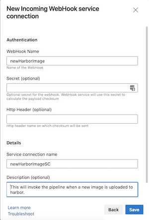

# Tanzu Build Service with Azure DevOps and Harbor

This example will outline how to integrate the Tanzu Build Service in to a CICD pipeline using Azure DevOps as the pipeline solution and Harbor as the container registry.

For a high level overview of how the Tanzu Build Service (TBS) in a CICD pipeline works, please review the [main readme](https://github.com/ryan-a-baker/tanzu-build-service-cicd-examples/blob/master/readme.md)

# Overview

As documented in the main workflow, there are two pipelines that are required to trigger the image build in TBS and then deploy the newly created image.

## Azure-Pipelines-cd-1.yml

This pipeline is responsible for monitoring the target branch and triggering a build in TBS when a new commit is made to the branch.

The general workflow is:

1) Download, Install, and Authenticate the Pivnet CLI
2) Download and Install the KPack CLI from the Tanzu network
3) Setup kubeconfig using secret variables provided to the pipeline so that kpack CLI can authenticate to our cluster
3) Run the kpack CLI `kp image patch` command in order update the commit SHA for the image to trigger a build
4) Wait for the build to complete successfully

Optionally - you could insert integration tests in to the workflow before you build the image to ensure all tests pass if that was not performed as part of your CI pipeline.

## Azure-Pipelines-cd-2.yml

The second webhook is responsible for deploying the newly built image to Kubernetes.  It is triggered by a webhook from Harbor when a new image is pushed.  By using that registry as our trigger, we can capture image builds from a code commit, as well as a TBS Stack Patch.

The workflow for this pipeline is as follows:

1. Webhook request recieved from Harbor due to new image push
2. Image Digest extracted from the webhook payload
3. Update the image tag for the development environment using Helm
4. Update the image tag for the production environment using Helm

## Setup

As mentioned in the main workflow - the example workflow is designed to work with the common [Spring Pet Clinic](https://github.com/spring-projects/spring-petclinic) code sample.  Here are the rough steps to setup these pipelines if you wish to create a working example yourself.

1. Fork the [Spring Pet Clinic application](https://github.com/spring-projects/spring-petclinic)
2. Copy the "azure-pipelines-cd-1.yml" and "azure-pipelines-cd-2.yml" in to the fork
3. Use [this](https://ryanbaker.io/2021-07-26-svc-acct-kubectl/) guide to create a service account on your k8s cluster hosting TBS and save the Token, Certificate Authority Certificate, and K8S API Endpoint for the next step.
4. Create a new Azure DevOps pipeline using "azure-pipelines-cd-1.yml" as your template.
5. Create the following [variables](https://docs.microsoft.com/en-us/azure/devops/pipelines/process/variables?view=azure-devops&tabs=yaml%2Cbatch#secret-variables) on azure pipelines and assign the values.  This will be used to download kpack and provide a kubeconfig file for it.

| Variable | Secret | Value |
| -------- | ------ | ----- |
| api-token | Yes | A Pivnet access token to download kpack |
| k8s-api-server | No | The https endpoint for the K8S API hosting TBS |
| k8s-token | Yes | The token for your service account |
| k8s-cacrt-b64 | Yes | The base64 encrypted certificate authority certificate |

6. Create a new Azure DevOps pipeline using "azure-pipelines-cd-2.yml" as your template.
7.  Create a new ["Incoming Webhook"  Service Connection](https://docs.microsoft.com/en-us/azure/devops/release-notes/2020/pipelines/sprint-172-update#generic-webhook-based-triggers-for-yaml-pipelines) in your Azure DevOps project

8.  Create the webhook configuration in Harbor
